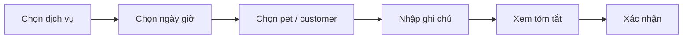
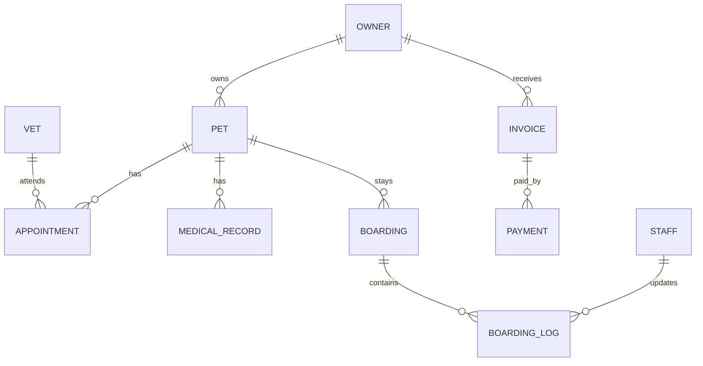
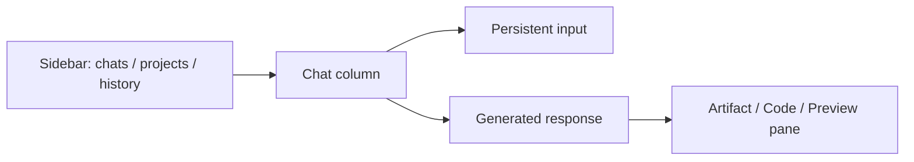

# Playbook thiết kế giao diện cho AI agent

> Tài liệu này tổng hợp và tái cấu trúc từ 3 báo cáo đã cung cấp, nhằm biến phần nghiên cứu thành **một spec triển khai duy nhất** để AI agent có thể dùng trực tiếp khi thiết kế hoặc code giao diện.

---

## 1. Mục tiêu của tài liệu

Tài liệu này giúp AI agent trả lời đúng 5 câu hỏi trước khi bắt tay vào thiết kế giao diện:

1. **Sản phẩm này là loại gì?** Website marketing, web app nghiệp vụ, dashboard nội bộ, portal khách hàng hay giao diện AI/chat.
2. **Điều hướng nên là gì?** Header, sidebar, hay kết hợp cả hai.
3. **Vai trò người dùng là ai?** Chủ nuôi, bác sĩ thú y, nhân viên trung tâm, quản trị viên, hoặc người dùng công cụ AI.
4. **Màn hình và component nào là bắt buộc?** Dashboard, booking flow, hồ sơ thú cưng, hồ sơ khám, bảng dữ liệu, thông báo, form, timeline, khu làm việc code.
5. **Tiêu chuẩn chất lượng là gì?** Responsive, accessibility, hierarchy, readability, empty/loading/error states, và tính nhất quán của design system.

Tài liệu được viết theo hướng **ra quyết định + tiêu chuẩn triển khai**, không chỉ mô tả xu hướng.

---

## 2. Phạm vi áp dụng

Playbook này phù hợp cho 4 nhóm sản phẩm:

### 2.1 Website marketing / landing page

Dùng để giới thiệu thương hiệu, dịch vụ, bảng giá, CTA đăng ký hoặc đặt lịch.

### 2.2 Web app / dashboard nghiệp vụ

Dùng sau đăng nhập, nơi người dùng làm việc hằng ngày với nhiều chức năng, dữ liệu, bảng biểu, thông báo và workflow.

### 2.3 Portal khách hàng

Dùng cho end-user xem hồ sơ, lịch sử, thanh toán, đặt lịch, theo dõi trạng thái dịch vụ.

### 2.4 Giao diện AI / chat / workspace

Dùng khi đầu vào chính là prompt, hội thoại, lịch sử phiên làm việc, khu tạo nội dung, chỉnh sửa code hoặc preview artifact.

---

## 3. Tư duy nền tảng khi thiết kế giao diện

### 3.1 Thiết kế theo hành vi thay vì theo thẩm mỹ

UI tốt không bắt đầu từ màu đẹp hay card đẹp, mà bắt đầu từ:

- người dùng cần làm gì,
- làm thường xuyên đến mức nào,
- làm trên thiết bị nào,
- trong bối cảnh nào,
- sai ở đâu dễ nhất,
- điều gì phải nhìn thấy ngay.

### 3.2 Ưu tiên cấu trúc trước, trang trí sau

Thứ tự đúng khi AI agent thiết kế:

1. Xác định vai trò và nhiệm vụ chính.
2. Lập cây điều hướng.
3. Chọn bố cục trang.
4. Chọn component.
5. Chọn hierarchy và spacing.
6. Chọn màu, icon, hiệu ứng.

Không làm ngược lại.

### 3.3 Tối ưu cho quét mắt, không chỉ cho “nhìn đẹp”

Người dùng quét giao diện rất nhanh. Vì vậy:

- nội dung quan trọng phải nằm ở vùng nhìn thấy đầu tiên,
- menu chính phải dễ đoán,
- CTA phải nổi bật,
- thông tin liên quan phải nhóm gần nhau,
- khối văn bản dài phải có khoảng trắng và nhịp đọc rõ.

### 3.4 Mỗi màn hình chỉ nên có một mục tiêu chính

Ví dụ:

- Landing page: thuyết phục và chuyển đổi.
- Dashboard: tóm tắt và dẫn vào thao tác thường dùng.
- Booking flow: hoàn tất đặt lịch.
- Medical record: tra cứu và cập nhật dữ liệu.
- AI workspace: nhập prompt, xem kết quả, chỉnh sửa artifact.

---

## 4. Chọn bố cục: khi nào dùng header, sidebar, hay kết hợp

## 4.1 Header-only

### Nên dùng khi:

- website công khai,
- ít mục điều hướng cấp 1,
- ưu tiên hero/banner/CTA,
- mục tiêu là đọc, xem, đăng ký, mua hàng.

### Phù hợp với:

- landing page SaaS,
- website dịch vụ,
- blog,
- ecommerce homepage,
- marketplace công khai.

### Không phù hợp khi:

- có nhiều module nghiệp vụ,
- cần điều hướng sâu,
- người dùng phải làm việc lâu trong hệ thống.

---

## 4.2 Sidebar-only hoặc sidebar-dominant

### Nên dùng khi:

- hệ thống nhiều chức năng,
- menu cấp 2 và cấp 3 lớn,
- người dùng thao tác lặp lại hằng ngày,
- cần context rõ giữa các module.

### Phù hợp với:

- dashboard nội bộ,
- admin panel,
- EMR/EHR, CRM, ERP,
- hệ thống quản lý trung tâm chăm sóc thú cưng,
- ứng dụng AI có lịch sử chat/project.

### Không phù hợp khi:

- website chủ yếu để đọc giới thiệu,
- màn hình cần tối đa chiều ngang cho hình ảnh lớn,
- có quá ít mục menu.

---

## 4.3 Header + Sidebar

### Nên dùng khi:

- cần phân tách điều hướng toàn cục và điều hướng nghiệp vụ,
- có cả khái niệm “khu vực hệ thống” lẫn “công cụ trong khu vực”,
- hệ thống phục vụ nhiều vai trò.

### Gợi ý phân vai:

- **Header:** logo, search, thông báo, profile, global actions.
- **Sidebar:** menu module, submenu, bộ lọc theo ngữ cảnh.

### Đây là lựa chọn mặc định tốt nhất cho web app phức tạp.

---

## 4.4 Ma trận quyết định nhanh

| Bối cảnh                |         Header |                 Sidebar | Kết luận                 |
| ----------------------- | -------------: | ----------------------: | ------------------------ |
| Landing page marketing  | Rất quan trọng |                  Ít cần | Header-only              |
| Ecommerce homepage      | Rất quan trọng |                  Ít cần | Header-only              |
| Trang danh mục sản phẩm |     Quan trọng |              Cần filter | Header + sidebar/filter  |
| Docs / knowledge base   |     Quan trọng |                 Rất cần | Header + sidebar         |
| Dashboard nghiệp vụ     |     Quan trọng |                 Rất cần | Header + sidebar         |
| Admin panel             |       Vừa phải |                 Rất cần | Sidebar-dominant         |
| Giao diện AI chat       |       Tối giản | Rất cần lịch sử/context | Minimal header + sidebar |

---

## 5. Quy tắc thiết kế header

## 5.1 Thành phần bắt buộc

Một header tốt thường có:

- logo hoặc brand,
- menu cấp 1,
- ô search nếu sản phẩm có nhiều nội dung hoặc dữ liệu,
- utility actions: đăng nhập, tài khoản, ngôn ngữ, trợ giúp,
- CTA chính.

## 5.2 Quy tắc triển khai

- Chỉ nên có **3–7 mục menu cấp 1**.
- CTA chính phải khác màu với menu thường.
- Logo luôn dẫn về trang chủ.
- Nếu sticky, header phải gọn khi scroll.
- Không để header cao quá mức làm mất không gian nội dung.
- Nếu có search, ưu tiên vị trí dễ thấy ở giữa hoặc gần góc phải.

## 5.3 Khi nào sticky header là đúng

Dùng sticky khi:

- website dài,
- người dùng cần search liên tục,
- cần CTA luôn hiển thị,
- dashboard cần truy cập thông báo/profile/global action nhanh.

Không nên sticky quá dày trên mobile.

## 5.4 Utility bar và promo bar

Có thể thêm một thanh nhỏ phía trên header để chứa:

- hotline,
- chuyển ngôn ngữ,
- địa điểm,
- khuyến mãi,
- FAQ.

Nhưng không nên nhồi quá nhiều khiến phần đầu trang bị nặng.

---

## 6. Quy tắc thiết kế sidebar

## 6.1 Sidebar nên chứa gì

Sidebar là nơi cho:

- menu hệ thống,
- module nghiệp vụ,
- submenu theo nhóm,
- trạng thái đang active,
- shortcut thường dùng,
- đôi khi là bộ lọc theo ngữ cảnh.

## 6.2 Sidebar không nên chứa gì

Không nên biến sidebar thành nơi nhét:

- banner marketing,
- quảng cáo,
- quá nhiều card KPI,
- nội dung dài cần đọc kỹ,
- thao tác phụ không liên quan ngữ cảnh.

## 6.3 Quy tắc triển khai

- Nhóm menu theo cụm 4–7 mục.
- Có icon nhưng không phụ thuộc hoàn toàn vào icon.
- Mục đang active phải nổi bật rõ ràng.
- Sidebar nên cho phép collapse.
- Trên desktop, chiều rộng gợi ý 240–280px.
- Khi collapse, còn lại khoảng 56–72px với icon rõ ràng.
- Trên mobile, chuyển sang off-canvas/hamburger drawer.

## 6.4 Sidebar trong hệ AI

Trong giao diện AI, sidebar không chỉ để điều hướng mà còn để quản lý:

- lịch sử hội thoại,
- project,
- folders,
- prompt templates,
- không gian làm việc riêng theo task,
- trạng thái context.

---

## 7. Cấu trúc giao diện theo loại sản phẩm

## 7.1 Website tin tức / blog

### Đặc điểm

- header mạnh,
- menu nhiều chuyên mục,
- đôi khi có sidebar bài nổi bật hoặc quảng cáo,
- nội dung chính ưu tiên khả năng đọc.

### Rule

- dùng header cho điều hướng chính,
- sidebar chỉ dành cho nội dung phụ,
- tránh để sidebar lấn át bài viết,
- nếu có right rail, phải sạch để tránh “mù cột phải”.

---

## 7.2 Ecommerce / marketplace

### Đặc điểm

- search là trung tâm,
- logo bên trái,
- account/cart/wishlist bên phải,
- mega menu hữu ích,
- filter sidebar chỉ dùng ở trang danh mục.

### Rule

- homepage ưu tiên header,
- listing page dùng filter sidebar,
- không dùng sidebar cố định trên trang chủ trừ trường hợp rất đặc biệt.

---

## 7.3 SaaS marketing website

### Đặc điểm

- header tối giản,
- 3–5 menu chính,
- CTA rõ,
- section dài,
- hero mạnh.

### Rule

- dùng sticky header gọn,
- tập trung vào value proposition và CTA,
- không dùng sidebar cho site marketing.

---

## 7.4 Dashboard / admin / enterprise app

### Đặc điểm

- sidebar là điều hướng chính,
- header là lớp utility,
- có table, form, notification, search, filters, actions.

### Rule

- dùng layout hỗn hợp,
- ưu tiên tốc độ thao tác hơn hình thức trưng bày,
- cho phép người dùng quay lại task nhanh.

---

## 7.5 Documentation / knowledge base

### Đặc điểm

- header có search,
- sidebar là table of contents,
- nội dung trung tâm cần chiều rộng đọc hợp lý.

### Rule

- sidebar trái cho mục lục,
- cột nội dung không quá rộng,
- heading, anchor link, code block phải rõ.

---

## 7.6 Giao diện AI / chat / workspace

### Đặc điểm

- input là trung tâm,
- lịch sử chat ở sidebar,
- header tối giản,
- cột đọc hẹp hơn web thường,
- có thể có pane phụ để code/artifact/preview.

### Rule

- không nhồi menu top kiểu website truyền thống,
- ưu tiên readability của hội thoại,
- có khu riêng cho code hoặc artifact,
- hỗ trợ temporal navigation thay vì chỉ spatial navigation.

---

## 8. Khác biệt cốt lõi giữa website truyền thống và giao diện AI

## 8.1 Website truyền thống là trải nghiệm tất định

Người dùng bấm vào một nút và mong đợi một kết quả xác định.

### Hệ quả UI:

- menu rõ,
- cấu trúc cố định,
- flow tuần tự,
- hierarchy tuyến tính.

## 8.2 Giao diện AI là trải nghiệm xác suất

Người dùng nhập ý định bằng ngôn ngữ tự nhiên và hệ thống sinh ra phản hồi có biến thiên.

### Hệ quả UI:

- top nav giảm vai trò,
- prompt box thành điểm điều hướng trung tâm,
- sidebar giữ lịch sử và ngữ cảnh,
- cần trạng thái giải thích hệ thống đang làm gì,
- cần hỗ trợ chỉnh sửa kết quả sau khi sinh.

## 8.3 Vì sao giao diện AI thường có cột nội dung hẹp

Không gian chat hẹp là đúng vì:

- đoạn văn dài quá rộng khó đọc,
- code và prose cần cách xử lý khác nhau,
- mắt khó quay lại đầu dòng nếu dòng quá dài,
- cột hẹp giúp đọc hội thoại dễ hơn.

### Rule cho AI agent

- prose: giới hạn chiều rộng đọc,
- code: tách qua pane hoặc workspace riêng,
- bảng lớn: mở rộng hoặc full-width riêng, không nhét vào chat hẹp.

## 8.4 Vì sao sidebar quan trọng trong AI workspace

Sidebar trong AI không đơn thuần là nav. Nó là:

- kho lịch sử,
- bộ nhớ theo task,
- điểm chuyển ngữ cảnh,
- không gian tổ chức project,
- cơ chế quay lại output cũ.

## 8.5 Vì sao không nên lạm dụng gradient kiểu “AI purple”

Màu tím/xanh tím, glow, glassmorphism có thể tạo cảm giác “AI”, nhưng dễ gây:

- mệt mắt,
- thiếu nghiêm túc trong sản phẩm chuyên nghiệp,
- giảm khả năng đọc,
- mất bản sắc nếu ai cũng giống nhau.

### Rule

- dùng accent có kiểm soát,
- ưu tiên contrast và clarity,
- chỉ dùng hiệu ứng ở vùng nhấn, không phủ toàn bộ UI.

---

## 9. Nguyên tắc bố cục và hierarchy

## 9.1 Vùng ưu tiên trên màn hình

Thứ tự ưu tiên:

1. brand và định hướng,
2. tiêu đề trang,
3. CTA hoặc action chính,
4. nội dung chính,
5. thông tin phụ,
6. trang trí.

## 9.2 Nhịp khoảng trắng

AI agent phải dùng spacing nhất quán, ví dụ:

- 4px: vi sai rất nhỏ,
- 8px: khoảng cách vi mô,
- 12px: giữa label và input,
- 16px: khoảng cách mặc định trong card,
- 24px: giữa sections nhỏ,
- 32px: giữa blocks lớn,
- 48–64px: giữa major sections.

## 9.3 Quy tắc nhóm nội dung

- Thông tin thuộc cùng nhiệm vụ phải gần nhau.
- Thông tin phụ đẩy xuống sau.
- KPI chỉ hiện KPI hành động được.
- Card không nên chứa quá nhiều loại nội dung khác nhau.

## 9.4 Fold đầu tiên

Trong vùng đầu tiên nhìn thấy, phải có ít nhất:

- tên sản phẩm hoặc tên trang,
- nội dung hoặc hành động quan trọng nhất,
- định hướng tiếp theo.

---

## 10. Typography và readability

## 10.1 Quy tắc chung

- Ưu tiên sans-serif dễ đọc.
- Body text desktop: 15–18px.
- Body text mobile: 14–16px.
- Line-height body: 1.5–1.7.
- Heading phải có chênh cấp rõ.

## 10.2 Scale gợi ý

- H1: 32–40px
- H2: 24–30px
- H3: 20–24px
- H4: 16–18px
- Body: 15–16px
- Caption: 12–13px

## 10.3 Chiều rộng đọc

- Nội dung dài không nên full-width vô hạn.
- Bài viết, docs, chat response nên có chiều rộng đọc giới hạn.
- Bảng, dashboard metrics và gallery có thể rộng hơn prose.

## 10.4 Plain language

- Label phải rõ nghĩa.
- Không dùng jargon nếu người dùng không quen.
- Error message phải chỉ cách sửa.

---

## 11. Design system tối thiểu AI agent phải tạo

## 11.1 Foundations

Agent phải định nghĩa ít nhất:

- màu nền,
- màu chữ,
- màu primary,
- màu success/warning/error/info,
- typography scale,
- spacing scale,
- radius scale,
- shadow scale,
- icon size,
- breakpoint.

## 11.2 Token gợi ý

```yaml
color:
  bg: "#FFFFFF"
  surface: "#F8FAFC"
  text: "#0F172A"
  textMuted: "#475569"
  border: "#E2E8F0"
  primary: "#2563EB"
  success: "#16A34A"
  warning: "#D97706"
  error: "#DC2626"
  info: "#0891B2"

radius:
  sm: 6
  md: 10
  lg: 14
  xl: 20

shadow:
  sm: "0 1px 2px rgba(0,0,0,0.06)"
  md: "0 4px 12px rgba(0,0,0,0.08)"
  lg: "0 12px 24px rgba(0,0,0,0.12)"
```

## 11.3 Thành phần primitive

Agent phải có:

- button,
- input,
- textarea,
- select,
- checkbox/radio/switch,
- badge,
- avatar,
- card,
- modal,
- drawer,
- table,
- tabs,
- toast,
- tooltip,
- breadcrumb,
- pagination,
- empty state,
- skeleton/loading state.

---

## 12. Thành phần UI bắt buộc cho web app nghiệp vụ

## 12.1 Forms

### Rule

- Mỗi field có label rõ.
- Placeholder không thay thế label.
- Field bắt buộc phải được đánh dấu nhất quán.
- Có helper text khi định dạng dễ sai.
- Error hiển thị cạnh field, không chỉ ở đầu form.
- Submit button chỉ disable khi có lý do rõ ràng.
- Có trạng thái saving/success/error.

### Ví dụ field tốt

- Tên thú cưng
- Ngày sinh (DD/MM/YYYY)
- Giống loài
- Tình trạng tiêm phòng
- Số điện thoại chủ nuôi

## 12.2 Data table

### Rule

- Bảng chỉ dùng cho dữ liệu có tính so sánh theo cột.
- Có header cột rõ.
- Có sort/filter/search nếu dữ liệu nhiều.
- Có trạng thái empty/no results.
- Trên mobile, bảng lớn phải chuyển card list hoặc horizontal scroll có kiểm soát.

### Cột điển hình trong hệ pet care

- Pet
- Chủ nuôi
- Dịch vụ
- Ngày hẹn
- Trạng thái
- Thanh toán
- Hành động

## 12.3 Cards

Dùng card khi cần:

- KPI,
- tóm tắt hồ sơ,
- quick actions,
- service package,
- cảnh báo.

Không nên dùng card cho mọi thứ. Quá nhiều card sẽ làm dashboard rời rạc.

## 12.4 Timeline

Dùng cho:

- lịch sử khám,
- timeline boarding,
- log hoạt động,
- trạng thái xử lý ca bệnh.

### Rule

- mỗi event phải có timestamp,
- loại sự kiện phải nhận diện nhanh,
- có thể mở rộng chi tiết,
- nên lọc được theo loại sự kiện.

## 12.5 Kanban

Dùng cho:

- bệnh nhân chờ khám,
- workflow grooming,
- tác vụ staff,
- follow-up cases.

### Rule

- số cột ít,
- mỗi cột biểu diễn trạng thái thực sự có hành động,
- thẻ phải đủ thông tin để quyết định nhanh,
- tránh nhồi metadata quá nhiều lên card.

## 12.6 Notifications

Gồm 3 lớp:

- **toast:** phản hồi ngắn hạn,
- **banner:** cảnh báo hoặc thông tin quan trọng,
- **notification center:** sự kiện cần xem lại.

### Rule

- severity phải rõ,
- có icon và màu phù hợp,
- không lạm dụng modal cho thông báo.

## 12.7 Search và filter

### Rule

- Search global ở header nếu hệ thống có nhiều dữ liệu.
- Filter theo ngữ cảnh đặt gần bảng hoặc list.
- Filter phải nhìn thấy trạng thái đang áp dụng.
- Có nút clear filters.

---

## 13. Thành phần UI đặc thù cho trung tâm chăm sóc thú cưng

## 13.1 Booking flow

### Các bước tối thiểu

1. Chọn loại dịch vụ.
2. Chọn cơ sở hoặc bác sĩ/nhân viên.
3. Chọn ngày giờ.
4. Chọn thú cưng.
5. Nhập ghi chú.
6. Xem tóm tắt giá và chính sách.
7. Xác nhận.

### Rule

- stepper phải rõ tiến trình,
- luôn có back/next,
- tóm tắt booking luôn hiện ở bước cuối,
- các ràng buộc phải hiển thị trước khi submit.

## 13.2 Pet profile

### Khu vực chính

- ảnh thú cưng,
- thông tin cơ bản,
- owner info,
- vaccine status,
- lịch sử khám,
- thuốc đang dùng,
- tài liệu đính kèm,
- hóa đơn liên quan.

### Bố cục gợi ý

- header hồ sơ với avatar + thông tin ngắn,
- tabs: Overview / Medical / Vaccines / Appointments / Boarding / Billing / Files.

## 13.3 Medical record

### Thành phần nên có

- summary panel,
- timeline các lần khám,
- kết quả xét nghiệm,
- chẩn đoán,
- thuốc,
- file scan/tài liệu,
- ghi chú bác sĩ,
- hành động nhanh: in, chia sẻ, tải xuống.

## 13.4 Boarding log

### Thành phần nên có

- check-in/check-out,
- khung giờ ăn,
- đi dạo,
- vệ sinh,
- tình trạng sức khỏe,
- ảnh/video cập nhật,
- ghi chú gửi chủ.

## 13.5 Invoices & payments

### Thành phần nên có

- mã hóa đơn,
- dịch vụ,
- ngày,
- tổng tiền,
- trạng thái,
- phương thức thanh toán,
- CTA thanh toán hoặc tải hóa đơn.

## 13.6 Messaging

### Dùng cho

- nhắc lịch,
- cập nhật boarding,
- phản hồi từ bác sĩ,
- xác nhận dịch vụ,
- xử lý sau khám.

---

## 14. Dashboard theo vai trò

## 14.1 Chủ nuôi (Pet Owner)

### Mục tiêu

Xem nhanh tình trạng thú cưng, lịch hẹn, nhắc vaccine, thanh toán, và liên lạc.

### Nội dung ưu tiên

- KPI: số thú cưng, lịch hẹn tới, nhắc vaccine, hóa đơn chưa thanh toán.
- Quick actions: đặt lịch, chat, mua thuốc, xem hồ sơ.
- Upcoming appointments.
- Recent medical records.
- Boarding updates nếu có.

### Bố cục gợi ý

- Header + portal nav đơn giản.
- Không cần sidebar nặng nếu chỉ vài chức năng.
- Mobile-first mạnh.

---

## 14.2 Bác sĩ thú y (Veterinarian)

### Mục tiêu

Quản lý lịch khám, xem hồ sơ nhanh, cập nhật bệnh án, kê toa, theo dõi ca ưu tiên.

### Nội dung ưu tiên

- lịch khám hôm nay,
- queue bệnh nhân,
- alert ca cần chú ý,
- quick access đến hồ sơ,
- task board,
- xét nghiệm chờ xử lý.

### Bố cục gợi ý

- Sidebar + header utility.
- Dashboard thiên về thao tác, ít trang trí.
- Search nhanh theo pet/owner/case.

---

## 14.3 Nhân viên grooming / boarding / front desk

### Mục tiêu

Quản lý ca dịch vụ, check-in/out, lịch làm việc, cập nhật trạng thái và liên lạc khách.

### Nội dung ưu tiên

- lịch hôm nay,
- pets đang ở trung tâm,
- tasks cần làm theo giờ,
- boarding log,
- quick actions: check-in, gửi ảnh, xác nhận khách đến.

### Bố cục gợi ý

- Sidebar rõ module,
- list theo thời gian,
- mobile/tablet friendly vì thường thao tác tại hiện trường.

---

## 14.4 Quản trị viên (Admin)

### Mục tiêu

Quản trị hệ thống, nhân sự, doanh thu, lịch, dịch vụ và quyền hạn.

### Nội dung ưu tiên

- KPI tổng quan,
- doanh thu,
- công suất lịch,
- quản lý người dùng,
- thiết lập dịch vụ,
- cảnh báo hệ thống,
- báo cáo.

### Bố cục gợi ý

- Sidebar mạnh,
- nhiều table/report/filter,
- dashboard có chart nhưng không lấn thao tác chính.

---

## 15. Mẫu sitemap đề xuất cho hệ pet care

```text
Public Site
├── Trang chủ
├── Dịch vụ
│   ├── Khám bệnh
│   ├── Grooming
│   ├── Boarding
│   └── Tiêm phòng
├── Bảng giá
├── Cơ sở / Chi nhánh
├── FAQ
├── Blog / Kiến thức
└── Đặt lịch

Authenticated Portal / App
├── Dashboard
├── Pets
│   ├── Danh sách thú cưng
│   └── Hồ sơ thú cưng
├── Appointments
├── Medical Records
├── Boarding Logs
├── Prescriptions
├── Billing
├── Messages
└── Settings

Staff / Admin App
├── Dashboard
├── Appointments
├── Patients / Pets
├── Owners
├── Medical Records
├── Grooming
├── Boarding
├── Billing
├── Inventory
├── Staff
├── Reports
└── System Settings
```

---

## 16. Page templates AI agent nên dùng

## 16.1 Marketing page template

```text
Header
Hero
Proof / Trust signals
Feature sections
Pricing / CTA
FAQ
Footer
```

## 16.2 Dashboard template

```text
Header (search, notifications, profile)
Sidebar (modules)
Page title + breadcrumb + primary action
KPI row
Main working area
Secondary panels / recent activity
```

## 16.3 Record detail template

```text
Header
Sidebar
Page title + status + quick actions
Summary card
Tabs or sections
Timeline / table / notes / files
```

## 16.4 Booking flow template

```text
Header nhẹ
Stepper
Main form area
Summary sidebar / summary drawer
Actions: Back / Next / Confirm
```

## 16.5 AI workspace template

```text
Minimal header
Sidebar: chats / projects / history
Main chat column
Secondary pane: artifact / code / preview / sources
Persistent input area
```

---

## 17. Responsive rules

## 17.1 Breakpoints gợi ý

- Mobile: < 768px
- Tablet: 768–1023px
- Desktop: 1024–1439px
- Large desktop: >= 1440px

## 17.2 Rule theo breakpoint

### Mobile

- 1 cột,
- menu thành drawer hoặc bottom nav,
- form xếp dọc,
- table đổi thành card list nếu cần,
- CTA lớn, dễ chạm.

### Tablet

- có thể dùng sidebar thu gọn,
- grid 2 cột vừa phải,
- bảng giữ lại nếu số cột ít.

### Desktop

- sidebar đầy đủ,
- dashboard grid linh hoạt,
- table và charts phát huy tối đa.

## 17.3 Touch targets

- button/icon tối thiểu ~40x40px,
- khoảng cách chạm đủ rộng,
- không đặt 2 icon nguy hiểm quá sát nhau.

---

## 18. Accessibility rules bắt buộc

## 18.1 Contrast

- text nhỏ: tối thiểu 4.5:1,
- text lớn: tối thiểu 3:1,
- trạng thái disabled vẫn phải nhìn ra nhưng không gây nhầm là active.

## 18.2 Keyboard navigation

- tab order logic,
- focus visible rõ,
- modal trap focus,
- không có vùng quan trọng chỉ hover mới thấy.

## 18.3 Form accessibility

- label gắn với input,
- error có text thật, không chỉ màu,
- required và optional rõ ràng,
- helper text đặt gần field.

## 18.4 Semantic structure

- dùng heading đúng cấp,
- table dùng cấu trúc bảng thật,
- button là button, link là link,
- landmark rõ: header/nav/main/aside/footer.

## 18.5 Motion

- animation nhẹ,
- tránh motion làm lạc hướng,
- tôn trọng reduced motion nếu có.

---

## 19. Trạng thái giao diện mà AI agent không được bỏ qua

## 19.1 Empty state

Mỗi list/table/dashboard mới phải có empty state tốt:

- giải thích ngắn,
- nêu bước tiếp theo,
- có CTA tạo dữ liệu đầu tiên.

## 19.2 Loading state

- dùng skeleton cho vùng quan trọng,
- spinner chỉ dùng khi loading ngắn hoặc rất nhỏ,
- giữ layout ổn định tránh nhảy bố cục.

## 19.3 Error state

- nói rõ điều gì xảy ra,
- có cách thử lại,
- không đổ lỗi cho người dùng,
- nếu lỗi field thì chỉ đúng field đó.

## 19.4 Partial state

Hữu ích trong AI interface:

- đang sinh nội dung,
- đang stream,
- đang index,
- đang tải nguồn,
- đã hoàn tất một phần.

## 19.5 Permission state

Nếu user không có quyền:

- phải giải thích,
- không chỉ ẩn nội dung rồi để trang trống,
- có CTA liên hệ admin nếu cần.

---

## 20. Code, bảng lớn và artifact trong giao diện AI

## 20.1 Không ép code vào bubble chat nhỏ

Khi output là code dài, agent nên:

- mở pane riêng,
- dùng editor-like surface,
- có line numbers nếu cần,
- có copy action,
- có wrap hoặc horizontal scroll hợp lý,
- có actions: apply, compare, revert.

## 20.2 Khác biệt giữa prose và code

- prose tối ưu cho đọc,
- code tối ưu cho scan và chỉnh sửa,
- bảng tối ưu cho so sánh,
- preview tối ưu cho đánh giá kết quả.

Không dùng một layout cho tất cả.

## 20.3 Workspace song song

Mẫu tốt cho AI tool:

- chat bên trái hoặc giữa,
- artifact/canvas bên phải,
- cho phép chỉnh sửa chính xác,
- không buộc người dùng prompt lại toàn bộ chỉ vì muốn sửa 1 đoạn nhỏ.

---

## 21. Checklist thẩm mỹ: làm đẹp đúng cách

## 21.1 Nên làm

- dùng accent color có chủ đích,
- có hierarchy rõ,
- giữ surface sạch,
- border và shadow nhẹ,
- icon nhất quán,
- illustration chỉ dùng khi có giá trị.

## 21.2 Không nên làm

- lạm dụng gradient/glow,
- quá nhiều màu nhấn,
- card chồng card chồng card,
- bo góc quá lớn không có lý do,
- dùng mọi trend cùng lúc,
- dùng dark mode nhưng contrast kém.

---

## 22. Wireframe mô tả nhanh để AI agent bám theo

## 22.1 Dashboard desktop

```mermaid
flowchart LR
    A[Header: Logo | Search | Notifications | Profile] --> B[Main Layout]
    C[Sidebar: Dashboard / Pets / Appointments / Billing / Settings] --> B
    B --> D[KPI Row]
    B --> E[Primary Work Area]
    B --> F[Recent Activity / Alerts]
```

## 22.2 Dashboard mobile

```mermaid
flowchart TB
    A[Header: Logo | Menu | Profile]
    A --> B[KPI cards stacked]
    B --> C[Upcoming appointments]
    C --> D[Quick actions]
    D --> E[Recent records]
```

## 22.3 Booking flow



## 22.4 Quan hệ dữ liệu hệ pet care



## 22.5 AI workspace



---

## 23. Quy trình làm việc bắt buộc cho AI agent trước khi code UI

## 23.1 Bước 1: Xác định loại sản phẩm

Agent phải gắn nhãn một trong các loại:

- marketing site,
- portal,
- dashboard,
- AI workspace,
- hybrid.

## 23.2 Bước 2: Liệt kê vai trò

Ví dụ:

- guest,
- pet owner,
- vet,
- staff,
- admin.

## 23.3 Bước 3: Tạo sitemap và screen inventory

Mỗi vai trò có:

- màn dashboard,
- list screens,
- detail screens,
- create/edit flows,
- states.

## 23.4 Bước 4: Chọn layout cho từng khu vực

Ví dụ:

- public site: header-only,
- portal owner: simple header + tab nav,
- staff/admin: header + sidebar,
- AI assistant: minimal header + history sidebar + artifact pane.

## 23.5 Bước 5: Tạo design system tối thiểu

Không được code từng trang một cách rời rạc trước khi có token và component chung.

## 23.6 Bước 6: Thiết kế ưu tiên theo tần suất dùng

Những gì dùng nhiều nhất phải được tối ưu nhất.

## 23.7 Bước 7: Kiểm tra accessibility và responsive

Không chờ đến cuối mới kiểm.

---

## 24. Definition of Done cho giao diện

Một màn hình chỉ được coi là hoàn thành khi đạt đủ:

### 24.1 Cấu trúc

- có title rõ,
- có nav đúng,
- có primary action,
- có hierarchy rõ.

### 24.2 Tương tác

- hover/focus/active/disabled states đầy đủ,
- loading/success/error/empty states đầy đủ,
- thao tác chính hoàn tất được.

### 24.3 Responsive

- desktop dùng ổn,
- tablet không vỡ,
- mobile vẫn thao tác được.

### 24.4 Accessibility

- keyboard dùng được,
- contrast đạt,
- form có label,
- semantic hợp lý.

### 24.5 Tính nhất quán

- spacing không loạn,
- icon không lẫn phong cách,
- CTA không đổi màu tùy hứng,
- component cùng loại dùng chung một pattern.

---

## 25. Ưu tiên triển khai nếu phải làm theo pha

## Pha 1: Khung sống còn

- auth + role,
- layout,
- navigation,
- dashboard cơ bản,
- form cơ bản,
- list/table cơ bản,
- empty/loading/error states.

## Pha 2: Nghiệp vụ chính

- booking flow,
- pet profile,
- medical record,
- billing,
- notifications,
- search/filter.

## Pha 3: Tối ưu trải nghiệm

- analytics,
- timeline nâng cao,
- kanban,
- file attachments,
- realtime updates,
- AI assistant pane,
- artifact/code workspace.

## Pha 4: Tinh chỉnh

- personalization,
- advanced accessibility,
- animation tinh gọn,
- dark mode,
- design audit,
- usability testing refinements.

---

## 26. Hướng dẫn ngắn gọn để AI agent ra quyết định đúng

### Nếu sản phẩm là website giới thiệu:

- dùng header mạnh,
- hero rõ,
- CTA nổi,
- không dùng sidebar nếu không có lý do đặc biệt.

### Nếu sản phẩm là dashboard nghiệp vụ:

- dùng header utility + sidebar module,
- dashboard phục vụ thao tác chứ không trưng bày,
- table, search, filters là hạ tầng bắt buộc.

### Nếu sản phẩm là portal chủ nuôi:

- đơn giản hóa điều hướng,
- mobile-first,
- ưu tiên lịch hẹn, hồ sơ, thanh toán, cập nhật.

### Nếu sản phẩm là giao diện AI:

- top nav tối giản,
- sidebar quản lý lịch sử/context,
- chat column có chiều rộng đọc hợp lý,
- code/artifact phải có pane riêng.

### Nếu không chắc chọn header hay sidebar:

- ít mục + thiên marketing => header,
- nhiều module + thiên thao tác => sidebar,
- cả hai nhu cầu cùng lúc => hybrid.

---

## 27. Kết luận

Một giao diện tốt không phải là giao diện có nhiều hiệu ứng, mà là giao diện giúp người dùng:

- hiểu mình đang ở đâu,
- biết phải làm gì tiếp theo,
- hoàn thành tác vụ nhanh,
- tránh lỗi,
- quay lại công việc cũ dễ dàng,
- cảm thấy hệ thống đáng tin.

Với website truyền thống, **header** thường là công cụ định hướng chính.
Với web app nghiệp vụ, **sidebar** trở thành trung tâm thao tác.
Với hệ AI/chat, **prompt box + history sidebar + workspace pane** mới là cấu trúc hợp lý.

Nếu AI agent phải chọn một nguyên tắc cốt lõi duy nhất để làm theo, hãy dùng nguyên tắc này:

> **Thiết kế theo nhiệm vụ, ngữ cảnh và mức độ lặp lại của hành vi người dùng; không thiết kế theo xu hướng thị giác đơn thuần.**

---

## 28. Phụ lục: checklist ngắn để copy-paste cho agent

```text
1. Xác định loại sản phẩm: marketing / portal / dashboard / AI workspace / hybrid
2. Xác định vai trò người dùng
3. Lập sitemap
4. Chọn layout: header / sidebar / hybrid
5. Tạo design tokens
6. Tạo component library tối thiểu
7. Thiết kế các page templates chính
8. Bổ sung empty/loading/error/permission states
9. Kiểm tra responsive
10. Kiểm tra accessibility
11. Tối ưu prose vs code vs tables theo đúng layout
12. Chỉ thêm hiệu ứng sau khi cấu trúc đã đúng
```
